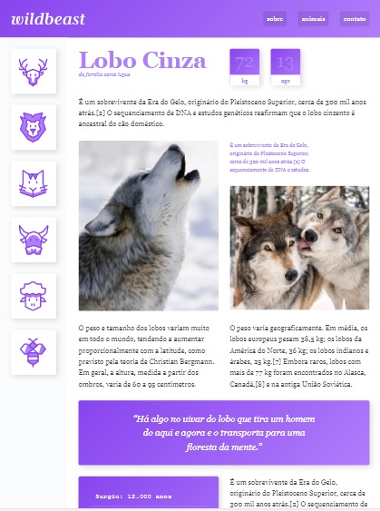

# wildBeast
 WildBeast is a website about wild animals.

## Overview


The website has 3 breakpoints, there are breakpoints in 760px, 600px e 1200px.

This website adapts its contents according with your screen size.

## 1200px Breakpoint
This an overview from an Ipad Pro that has 1024x1366px.



### 760px Breakpoint
Overview with 760x1024px, i used the responsible tool of browser to see and screenshot it.


### 600px Breakpoint
It is a overview from a Surface Duo that has 540x720px.

 

## What more the website has to offer ?
Good question. This website counts with information about average age, weight, family and emergence.


## How can I run this website?

```
- Download this repository or clone it
$ git clone https://github.com/SentlySS/wildBeast wildBeast

-Run the archive 'index.html'
```